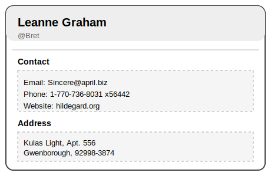
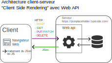

# Affichage d'informations d'utilisateurs - requêtage JS

## Objectif de développement

Vous allez implémenter une interface graphique présentant des informations sur des utilisateurs.

Le code HTML de cette interface devra être générée par du JS en client ("client side rendering").

Les information des utilisateurs devront, à terme, provenir d'une web api qui sera requêter pas JS de façon asynchrone.

Compétences abordées :
- développement d'interface graphique en JS vanilla
- manipulation de DOM
- traitement de struture JSON
- requêtage HTTP en JS (utilisation de la méthode "fetch")

> [!IMPORTANT]
> Etapes de développement :
> 1. développement de l'interface graphique à partir d'un fichier JSON
> 2. remplacement du chargement des utilisateurs par une requête vers une web api

## Etape 1 : avec fichier JS

Implémentez une interface permettant d’afficher des utilisateurs sous forme de cartes ("cards").

### Chargement des utilisateurs

Dans un premier temps les informations des utilisateurs proviendront d'une variable JS contenue dans un fichier, par example `users.js` comme présenté par la structure de code ci-dessous :

```text
|   index.html
|   README.md
|
+---css
|       style.css
|
+---img
\---js
        app.js
        users.js  // fichier contenant les informations utilisateurs
```

Ce fichier contient un tableau 1D avec un ensemble de structures telles que :
```json
{
  "id": 1,
  "name": "Leanne Graham",
  "username": "Bret",
  "email": "Sincere@april.biz",
  "address": {
    "street": "Kulas Light",
    "suite": "Apt. 556",
    "city": "Gwenborough",
    "zipcode": "92998-3874",
    "geo": {
      "lat": "-37.3159",
      "lng": "81.1496"
    }
  },
  "phone": "1-770-736-8031 x56442",
  "website": "hildegard.org",
  "company": {
    "name": "Romaguera-Crona",
    "catchPhrase": "Multi-layered client-server neural-net",
    "bs": "harness real-time e-markets"
  }
}
```

Ce tableau est disponible en utilisant la variable `users` qui est rendue accessible grâce à l'import du script `users.js` dans la page `index.html` :

```html
    <script src="js/users.js" defer></script>
    <script src="js/app.js" defer></script>
  ```

Vous devrez générer dynamiquement une carte utilisateur affichant les informations comme présentée par le wireframe suivant :



La carte devra être générée en JS en manipulant le DOM (cf. fonction `createUserCard(user)` du fichier `app.js`).

> [!IMPORTANT]
> Il vous est conseillé de commencer à concevoir le rendu avec des informations "en dur" en HTML avant de vous servir des informations contenues dans le tableau de JSON.

### Rêquêtage d'une web api

Vous allez maintenant changer la source des informations et utiliser un web api de test : 
```
https://jsonplaceholder.typicode.com/users
```

Cette partie devra :
- récupérer les utilisateurs depuis l’API
- stocker la liste des utilisateurs dans la variable JS appropriée

Pour effectuer des requêtes HTTP vers l’API REST, vous utiliserez la fonction JS `fetch()`.

Ci-dessous une représentation graphique de ce que vous allez mettre en place :



Vous allez donc pouvoir utiliser `fetch()` avec la méthode HTTP `GET` pour obtenir une liste d'utilisateurs.

Afin d'en apprendre plus sur le fonctionne de `fetch()` vous pourrez lire les parties "Fonctionnement de JavaScript fetch" et "Requêtes GET avec JavaScript fetch" de l'article disponible [ici](https://www.ionos.fr/digitalguide/sites-internet/developpement-web/api-javascript-fetch/#content-fonctionnement-de-javascript-fetch).

Voici donc exemple d'utilisation de `fetch()` dans notre cas :
```js
fetch("https://jsonplaceholder.typicode.com/users")
  .then(response => response.json())
  .then(users => {
    console.log(users);
  });
```

Une fois les utilisateurs récupéré il est possible de construire les composants graphiques comme précedemment.
